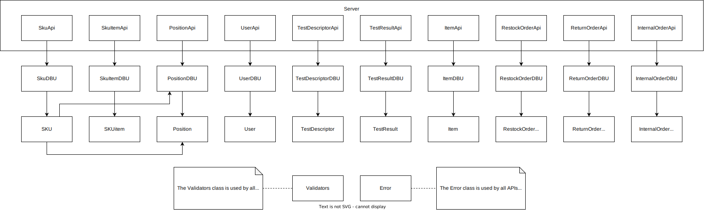

# Integration and API Test Report

Date: 23/05/2022

Version: 1.0

# Contents

- [Dependency graph](#dependency-graph)

- [Integration approach](#integration)

- [Tests](#tests)

- [Scenarios](#scenarios)

- [Coverage of scenarios and FR](#scenario-coverage)
- [Coverage of non-functional requirements](#nfr-coverage)

# Dependency graph 

     
# Integration approach

    <Write here the integration sequence you adopted, in general terms (top down, bottom up, mixed) and as sequence
    (ex: step1: class A, step 2: class A+B, step 3: class A+B+C, etc)> 
    <Some steps may correspond to unit testing (ex step1 in ex above), presented in other document UnitTestReport.md>
    <One step will correspond to API testing>

  Since all `model` classes have few to none logic, we never test them explicitly - except `SKU` and `Position`. We simply check their behaviour is correct by source code inspection.
  Moreover, we decided not to use mock-ups, since by design 
  # --------supercazzola per farlo sembrare clever--------------
  Overall, we use a bottom-up approach:

  |Stack|Step 1|Step 2|Step 3|Step 4|Step 5|
  |-----|------|------|------|------|------|
  |**SKU + Position**|Position | Position + PositionDBU | Position + PositionDBU + SKU| Position + PositionDBU + SKU + skuDBU | Position + PositionDBU + SKU + skuDBU + SkuApi|
  |                  |         |                        | Position + PositionDBU + PositionApi |||
  |**SKUitem**|SKUitem + SkuItemDBU|SKUitem + SkuItemDBU + SkuItemApi||||
  |**TestDescriptor**|TestDescriptor + TestDescriptorDBU | TestDescriptor + TestDescriptorDBU + TestDescriptorApi ||||
  |**TestResult**|TestResult + TestResultDBU | TestResult + TestResultDBU + TestResultApi |
  |**User**|User + UserDBU | User + UserDBU + UserApi ||||
  |**RestockOrder**|RestockOrder + RestockOrderDBU | RestockOrder + RestockOrderDBU + RestockOrderApi ||||
  |**ReturnOrder**|ReturnOrder + ReturnOrderDBU | ReturnOrder + ReturnOrderDBU + ReturnOrderApi ||||
  |**InternalOrder**|InternalOrder + InternalOrderDBU | InternalOrder + InternalOrderDBU + InternalOrderApi ||||
  |**Item**|Item + ItemDBU|Item + ItemDBU + ItemApi||||
    

#  Integration Tests

   <define below a table for each integration step. For each integration step report the group of classes under test, and the names of
     Jest test cases applied to them, and the mock ups used, if any> Jest test cases should be here code/server/unit_test

## Step 1
Step1 actually corresponds to unit testing.
For further information, please refer to [UnitTestReport.md](UnitTestReport.md).

| Classes |Jest test cases |
|--|--|
|Position|[position.test.js](./code/server/unit_test/position.test.js)|
|SKUitem + SKUitemDBU |[skuItemDBU.test.js](./code/server/unit_test/skuItemDBU.test.js)|
|TestDescriptor + TestDescriptorDBU|[testDescriptorDBU.test.js](./code/server/unit_test/testDescriptorDBU.test.js)|
|TestResult + TestResultDBU|[testResultDBU.test.js](./code/server/unit_test/testResultDBU.test.js)|
|User + UserDBU|[userDBU.test.js](./code/server/unit_test/userDBU.test.js)|
|RestockOrder + RestockOrderDBU|[restockOrderDBU.test.js](./code/server/unit_test/restockOrderDBU.test.js)|
|ReturnOrder + ReturnOrderDBU|[returnOrderDBU.test.js](./code/server/unit_test/returnOrderDBU.test.js)|
|InternalOrder + InteralOrderDBU|[internalOrderDBU.test.js](./code/server/unit_test/internalOrderDBU.test.js)|
|Item + ItemDBU|[itemDBU.test.js](./code/server/unit_test/itemDBU.test.js)|

## Step 2
Step2 is API testing for all stacks but `SKU` and `Position` ---------------

| Classes |Jest test cases |
|--|--|
|Position + PositionDBU|[positionDBU.test.js](./code/server/unit_test/positionDBU.test.js)|
|SKUitem + SKUitemDBU + SkuItemApi|[testSkuItemRouter.js](./code/server/test/testSkuItemRouter.js)|
|TestDescriptor + TestDescriptorDBU + TestDescriptorApi|[testTestDescriptorRouter.js](./code/server/test/testTestDescriptorRouter.js)|
|TestResult + TestResultDBU + TestResultApi|[testTestResultRouter.js](./code/server/test/testTestResultRouter.js)|
|User + UserDBU + UserApi|[testUserRouter.js](./code/server/test/testUserRouter.js)|
|RestockOrder + RestockOrderDBU + RestockOrderApi|[testRestockOrderRouter.js](./code/server/test/testRestockOrderRouter.js)|
|ReturnOrder + ReturnOrderDBU + ReturnOrderApi|[testReturnOrderRouter.js](./code/server/test/testReturnOrderRouter.js)|
|InternalOrder + InteralOrderDBU + InternalOrderApi|[testInternalOrderRouter.js](./code/server/test/testInternalOrderRouter.js)|
|Item + ItemDBU + ItemApi|[testItemRouter.js](./code/server/test/testItemRouter.js)|

## Step 3
Step3 is API testing for`Position` and model testing for  `SKU`
  
| Classes  |Jest test cases |
|--|--|
|Position + PositionDBU + PositionAPi|[testPositionRouter.js](./code/server/test/testPositionRouter.js)|
|Position + PositionDBU + SKU|[sku.test.js](./code/server/unit_test/sku.test.js)|

## Step 4
Step4 is Unit testing for `SKU`
  
| Classes  |Jest test cases |
|--|--|
|Position + PositionDBU + SKU + SkuDBU|[skuDBU.test.js](./code/server/unit_test/skuDBU.test.js)|

## Step 5
Step4 is Api testing for `SKU`
  
| Classes  |Jest test cases |
|--|--|
|Position + PositionDBU + SKU + SkuDBU + SkuApi|[testSkuRouter.js](./code/server/test/testSkuRouter.js)|

# API testing - Scenarios

<If needed, define here additional scenarios for the application. Scenarios should be named
 referring the UC in the OfficialRequirements that they detail>

## Scenario UCx.y

| Scenario |  name |
| ------------- |:-------------:| 
|  Precondition     |  |
|  Post condition     |   |
| Step#        | Description  |
|  1     |  ... |  
|  2     |  ... |

# Coverage of Scenarios and FR

<Report in the following table the coverage of  scenarios (from official requirements and from above) vs FR. 
Report also for each of the scenarios the (one or more) API Mocha tests that cover it. >  Mocha test cases should be here code/server/test

| Scenario ID | Functional Requirements covered | Mocha  Test(s) | 
| ----------- | ------------------------------- | ----------- | 
|  Scenario 1-1 | FR2.1 | PUT /api/sku/:id - correctly modify a SKU |
   |||PUT /api/sku/:id - SKU does not exist|
   |||PUT /api/sku/:id - available quantity is negative|
   |||PUT /api/sku/:id - position cannot contain weight and volume |
|  Scenario 1-2 | FR2.1 | PUT /api/sku/:id - correctly modify a SKU |
  |||PUT /api/sku/:id - SKU does not exist|
  |||PUT /api/sku/:id - available quantity is negative|
  |||PUT /api/sku/:id - position cannot contain weight and volume |
  ||FR2.4|    getSKU(GET /api/skus/:id - correctly get a SKU|
  |||getSKU(GET /api/skus/:id - passing a negative id|
  |||getSKU(GET /api/skus/:id - SKU does not exist|
  ||FR3.1.4| PUT /api/position/:posID - correctly modify a position|
  |||PUT /api/position/:posID - passing a field with a typo |
  |||PUT /api/position/:posID - position does not exist |
  |||PUT /api/position/:posID/changeID - correctly patch id|
  |||PUT /api/position/:posID/changeID - short new positionID|
  |||PUT /api/position/:posID/changeID - short old positionID|
  |||PUT /api/position/:posID/changeID - position does not exist|
  |||PUT /api/position/:posID/changeID - new id already exists|
|  Scenario 1-3 | FR2.4 | getSKU(GET /api/skus/:id - correctly get a SKU|
  |||getSKU(GET /api/skus/:id - passing a negative id|
  |||getSKU(GET /api/skus/:id - SKU does not exist|
  ||FR2.1|PUT /api/sku/:id - correctly modify a SKU |
  |||PUT /api/sku/:id - SKU does not exist|
  |||PUT /api/sku/:id - available quantity is negative|
  |||PUT /api/sku/:id - position cannot contain weight and volume |
|  Scenario 2-1 | FR3.1.4 | PUT /api/position/:posID - correctly modify a position|
  |||PUT /api/position/:posID - passing a field with a typo |
  |||PUT /api/position/:posID - position does not exist |
  |||PUT /api/position/:posID/changeID - correctly patch id|
  |||PUT /api/position/:posID/changeID - short new positionID|
  |||PUT /api/position/:posID/changeID - short old positionID|
  |||PUT /api/position/:posID/changeID - position does not exist|
  |||PUT /api/position/:posID/changeID - new id already exists|
|  Scenario 2-2 | FR3.1.4 |PUT /api/position/:posID - correctly modify a position|
  |||PUT /api/position/:posID - passing a field with a typo |
  |||PUT /api/position/:posID - position does not exist |
  |||PUT /api/position/:posID/changeID - correctly patch id|
  |||PUT /api/position/:posID/changeID - short new positionID|
  |||PUT /api/position/:posID/changeID - short old positionID|
  |||PUT /api/position/:posID/changeID - position does not exist|
  |||PUT /api/position/:posID/changeID - new id already exists|
|  Scenario 2-3 | FR3.1.4 | PUT /api/position/:posID - correctly modify a position|
  |||PUT /api/position/:posID - passing a field with a typo |
  |||PUT /api/position/:posID - position does not exist |
  |||PUT /api/position/:posID/changeID - correctly patch id|
  |||PUT /api/position/:posID/changeID - short new positionID|
  |||PUT /api/position/:posID/changeID - short old positionID|
  |||PUT /api/position/:posID/changeID - position does not exist|
  |||PUT /api/position/:posID/changeID - new id already exists|
|  Scenario 2-4 | FR3.1.4 | PUT /api/position/:posID - correctly modify a position|
  |||PUT /api/position/:posID - passing a field with a typo |
  |||PUT /api/position/:posID - position does not exist |
  |||PUT /api/position/:posID/changeID - correctly patch id|
  |||PUT /api/position/:posID/changeID - short new positionID|
  |||PUT /api/position/:posID/changeID - short old positionID|
  |||PUT /api/position/:posID/changeID - position does not exist|
  |||PUT /api/position/:posID/changeID - new id already exists|
|  Scenario 2-5 | FR3.1.2 | DELETE /api/position/:posID - correctly delete a position|
  |||DELETE /api/position/:posID - short positionID|
  |||DELETE /api/position/:posID - position does not exist|
|  Scenario 3-1 | FR5.1, FR5.3, FR5.5, FR5.6|POST /api/restockOrder - correctly adding a restock order|
  |||POST /api/restockOrder - wrong date format|
  |||POST /api/restockOrder - date is in the future|
  |||POST /api/restockOrder - product has missing SKUId|
  |||POST /api/restockOrder - supplier does not exist|
  |||POST /api/restockOrder - product has negative quantity|
|  Scenario 3-2 | FR5.1, FR5.5, FR5.3, FR5.6 | POST /api/restockOrder - correctly adding a restock order|
  |||POST /api/restockOrder - wrong date format|
  |||POST /api/restockOrder - date is in the future|
  |||POST /api/restockOrder - product has missing SKUId|
  |||POST /api/restockOrder - supplier does not exist|
  |||POST /api/restockOrder - product has negative quantity|
|  Scenario 4-1 | FR1.1 | POST /api/newUser - correctly add a new user|
  |||POST /api/newUser - user already existing|
  |||POST /api/newUser - wrong user data|
  |||POST /api/newUser - trying to create a manager|
|  Scenario 4-2 | FR1.1, FR1.5 | PUT /api/users/:username - correctly modify user type|
  |||PUT /api/users/:username - wrong username|
  |||PUT /api/users/:username - wrong old |
  |||PUT /api/users/:username - invalid username|
  |||PUT /api/users/:username - invalid body|
  |||PUT /api/users/:username - trying to change type of a manager|
|  Scenario 4-3 | FR1.4| GET /api/users - retrive all users(excluding managers) in the system|
  ||FR1.2 |DELETE /api/users/:username/:type - correctly delete a user|
  |||DELETE /api/users/:username/:type - invalid data|
  |||DELETE /api/users/:username/:type - trying to delete a manager|
  |||DELETE /api/users/:username/:type - correctly delete a user|
|  Scenario 5-1-1 |FR5.8.1|PUT /api/restockOrder/:id/skuItems - correctly add a list of sku items to an order|
  |||PUT /api/restockOrder/:id/skuItems - item is not inside an array|
  |||PUT /api/restockOrder/:id/skuItems - order state is not DELIVERED|
  |||PUT /api/restockOrder/:id/skuItems - order id is 0|
  |||PUT /api/restockOrder/:id/skuItems - typo in a sku item field|
  |||PUT /api/restockOrder/:id/skuItems - order does not exist|
  ||FR5.7 |PUT /api/restockOrder/:id - correctly patch the state of an order|
  |||PUT /api/restockOrder/:id - state does not exist|
  |||PUT /api/restockOrder/:id - order does not exist|
|  Scenario 5-2-1 |FR5.8.2| POST /api/skuitems/testResult - result is not boolean|
  |||POST /api/skuitems/testResult - sku item does not exist|
  |||POST /api/skuitems/testResult - test descriptor does not exist|
  |||POST /api/skuitems/testResult - sku item is too short|
  ||FR5.7|PUT /api/restockOrder/:id - correctly patch the state of an order|
  |||PUT /api/restockOrder/:id - state does not exist|
  |||PUT /api/restockOrder/:id - order does not exist|
|  Scenario 5-2-2 | FR5.8.2|POST /api/skuitems/testResult - result is not boolean|
  |||POST /api/skuitems/testResult - sku item does not exist|
  |||POST /api/skuitems/testResult - test descriptor does not exist|
  |||POST /api/skuitems/testResult - sku item is too short|
  ||FR5.7|PUT /api/restockOrder/:id - correctly patch the state of an order|
  |||PUT /api/restockOrder/:id - state does not exist|
  |||PUT /api/restockOrder/:id - order does not exist|
|  Scenario 5-2-3 | FR5.8.2|POST /api/skuitems/testResult - result is not boolean|
  |||POST /api/skuitems/testResult - sku item does not exist|
  |||POST /api/skuitems/testResult - test descriptor does not exist|
  |||POST /api/skuitems/testResult - sku item is too short|
  ||FR5.7|PUT /api/restockOrder/:id - correctly patch the state of an order|
  |||PUT /api/restockOrder/:id - state does not exist|
  |||PUT /api/restockOrder/:id - order does not exist|
|  Scenario 5-3-1 | FR5.8.3|POST /api/skuitem/ - correctly add a sku item|
  |||POST /api/skuitem/ - unexisting sku with matching id|
  |||POST /api/skuitem/ - wrong sku item data |
  ||FR3.1.4|PUT /api/position/:posID - correctly modify a position|
  |||PUT /api/position/:posID - passing a field with a typo |
  |||PUT /api/position/:posID - position does not exist |
  |||PUT /api/position/:posID/changeID - correctly patch id|
  |||PUT /api/position/:posID/changeID - short new positionID|
  |||PUT /api/position/:posID/changeID - short old positionID|
  |||PUT /api/position/:posID/changeID - position does not exist|
  |||PUT /api/position/:posID/changeID - new id already exists|
  ||FR2.4|getSKU(GET /api/skus/:id - correctly get a SKU|
  |||getSKU(GET /api/skus/:id - passing a negative id|
  |||getSKU(GET /api/skus/:id - SKU does not exist|
  ||FR2.1|PUT /api/sku/:id - correctly modify a SKU |
  |||PUT /api/sku/:id - SKU does not exist|
  |||PUT /api/sku/:id - available quantity is negative|
  |||PUT /api/sku/:id - position cannot contain weight and volume |
  ||FR5.7|PUT /api/restockOrder/:id - correctly patch the state of an order|
  |||PUT /api/restockOrder/:id - state does not exist|
  |||PUT /api/restockOrder/:id - order does not exist|
|  Scenario 5-3-2 | FR5.7 | PUT /api/restockOrder/:id - correctly patch the state of an order|
  |||PUT /api/restockOrder/:id - state does not exist|
  |||PUT /api/restockOrder/:id - order does not exist|
|  Scenario 5-3-3 | FR5.8.3, , ,  | |
  ||FR3.1.4|PUT /api/position/:posID - correctly modify a position|
  |||PUT /api/position/:posID - passing a field with a typo |
  |||PUT /api/position/:posID - position does not exist |
  |||PUT /api/position/:posID/changeID - correctly patch id|
  |||PUT /api/position/:posID/changeID - short new positionID|
  |||PUT /api/position/:posID/changeID - short old positionID|
  |||PUT /api/position/:posID/changeID - position does not exist|
  |||PUT /api/position/:posID/changeID - new id already exists|
  ||FR2.4|getSKU(GET /api/skus/:id - correctly get a SKU|
  |||getSKU(GET /api/skus/:id - passing a negative id|
  |||getSKU(GET /api/skus/:id - SKU does not exist|
  ||FR2.1|PUT /api/sku/:id - correctly modify a SKU |
  |||PUT /api/sku/:id - SKU does not exist|
  |||PUT /api/sku/:id - available quantity is negative|
  |||PUT /api/sku/:id - position cannot contain weight and volume |
  ||FR5.7|PUT /api/restockOrder/:id - correctly patch the state of an order|
  |||PUT /api/restockOrder/:id - state does not exist|
  |||PUT /api/restockOrder/:id - order does not exist|
|  Scenario 6-1 | FR5.9|POST /api/returnOrder - wrong date format|
  |||POST /api/returnOrder - restock order does not exist|
  |||POST /api/returnOrder - restock order id equal to 0|
  |||POST /api/returnOrder - product has negative price|
  ||FR5.10|GET /api/restockOrders/:id/returnItems - correctly get the return items|
  |||GET /api/restockOrders/:id/returnItems - order state is not COMPLETEDRETURN|
  |||GET /api/restockOrders/:id/returnItems - order does not exist|
  ||FR5.11|DELETE /api/restockOrder/:id - correctly delete an order|
  |||DELETE /api/restockOrder/:id - passing a negative id|
  |||DELETE /api/restockOrder/:id - order does not exist|
|  Scenario 6-2 | FR5.9| POST /api/returnOrder - wrong date format|
  |||POST /api/returnOrder - restock order does not exist|
  |||POST /api/returnOrder - restock order id equal to 0|
  |||POST /api/returnOrder - product has negative price|
  ||FR5.10|GET /api/restockOrders/:id/returnItems - correctly get the return items|
  |||GET /api/restockOrders/:id/returnItems - order state is not COMPLETEDRETURN|
  |||GET /api/restockOrders/:id/returnItems - order does not exist|
  ||FR3.1.4|PUT /api/position/:posID - correctly modify a position|
  |||PUT /api/position/:posID - passing a field with a typo |
  |||PUT /api/position/:posID - position does not exist |
  |||PUT /api/position/:posID/changeID - correctly patch id|
  |||PUT /api/position/:posID/changeID - short new positionID|
  |||PUT /api/position/:posID/changeID - short old positionID|
  |||PUT /api/position/:posID/changeID - position does not exist|
  |||PUT /api/position/:posID/changeID - new id already exists|
  ||FR2.4|getSKU(GET /api/skus/:id - correctly get a SKU|
  |||getSKU(GET /api/skus/:id - passing a negative id|
  |||getSKU(GET /api/skus/:id - SKU does not exist|
  ||FR2.1|PUT /api/sku/:id - correctly modify a SKU |
  |||PUT /api/sku/:id - SKU does not exist|
  |||PUT /api/sku/:id - available quantity is negative|
  |||PUT /api/sku/:id - position cannot contain weight and volume |
  ||FR5.11|DELETE /api/restockOrder/:id - correctly delete an order|
  |||DELETE /api/restockOrder/:id - passing a negative id|
  |||DELETE /api/restockOrder/:id - order does not exist|
|  Scenario 7-1 | FR1.5 |POST /api/managerSessions - correct manager log in|
  |||POST /api/managerSessions - wrong manager credentials|
  |||POST /api/customerSessions - correct customer log in|
  |||POST /api/customerSessions - wrong customer credentials|
  |||POST /api/supplierSessions - correct supplier log in|
  |||POST /api/supplierSessions - wrong supplier credentials|
  |||POST /api/clerkSessions - correct clerk log in|
  |||POST /api/clerkSessions - wrong clerk credentials|
  |||POST /api/qualityEmployeeSessions - correct quality employee log in|
  |||POST /api/qualityEmployeeSessions - wrong quality employee credentials|
  |||POST /api/deliveryEmployeeSessions - correct delivery employee log in|
  |||POST /api/deliveryEmployeeSessions - wrong delivery employee credentials|
|  Scenario 9-1 | FR6.1| |
  ||FR6.2||
  ||FR6.3||
  ||FR3.1.4|PUT /api/position/:posID - correctly modify a position|
  |||PUT /api/position/:posID - passing a field with a typo |
  |||PUT /api/position/:posID - position does not exist |
  |||PUT /api/position/:posID/changeID - correctly patch id|
  |||PUT /api/position/:posID/changeID - short new positionID|
  |||PUT /api/position/:posID/changeID - short old positionID|
  |||PUT /api/position/:posID/changeID - position does not exist|
  |||PUT /api/position/:posID/changeID - new id already exists|
  ||FR2.4|getSKU(GET /api/skus/:id - correctly get a SKU|
  |||getSKU(GET /api/skus/:id - passing a negative id|
  |||getSKU(GET /api/skus/:id - SKU does not exist|
  ||FR2.1|PUT /api/sku/:id - correctly modify a SKU |
  |||PUT /api/sku/:id - SKU does not exist|
  |||PUT /api/sku/:id - available quantity is negative|
  |||PUT /api/sku/:id - position cannot contain weight and volume |
  ||FR6.6||
  ||FR6.7||
|  Scenario 9-2 | FR6.1| |
  ||FR6.2||
  ||FR6.3||
  ||FR3.1.4|PUT /api/position/:posID - correctly modify a position|
  |||PUT /api/position/:posID - passing a field with a typo |
  |||PUT /api/position/:posID - position does not exist |
  |||PUT /api/position/:posID/changeID - correctly patch id|
  |||PUT /api/position/:posID/changeID - short new positionID|
  |||PUT /api/position/:posID/changeID - short old positionID|
  |||PUT /api/position/:posID/changeID - position does not exist|
  |||PUT /api/position/:posID/changeID - new id already exists|
  ||FR2.4|getSKU(GET /api/skus/:id - correctly get a SKU|
  |||getSKU(GET /api/skus/:id - passing a negative id|
  |||getSKU(GET /api/skus/:id - SKU does not exist|
  ||FR2.1|PUT /api/sku/:id - correctly modify a SKU |
  |||PUT /api/sku/:id - SKU does not exist|
  |||PUT /api/sku/:id - available quantity is negative|
  |||PUT /api/sku/:id - position cannot contain weight and volume |
  ||FR6.6||
  ||FR6.7||
|  Scenario 9-3 | FR6.1| |
  ||FR6.2||
  ||FR6.3||
  ||FR3.1.4|PUT /api/position/:posID - correctly modify a position|
  |||PUT /api/position/:posID - passing a field with a typo |
  |||PUT /api/position/:posID - position does not exist |
  |||PUT /api/position/:posID/changeID - correctly patch id|
  |||PUT /api/position/:posID/changeID - short new positionID|
  |||PUT /api/position/:posID/changeID - short old positionID|
  |||PUT /api/position/:posID/changeID - position does not exist|
  |||PUT /api/position/:posID/changeID - new id already exists|
  ||FR2.4|getSKU(GET /api/skus/:id - correctly get a SKU|
  |||getSKU(GET /api/skus/:id - passing a negative id|
  |||getSKU(GET /api/skus/:id - SKU does not exist|
  ||FR2.1|PUT /api/sku/:id - correctly modify a SKU |
  |||PUT /api/sku/:id - SKU does not exist|
  |||PUT /api/sku/:id - available quantity is negative|
  |||PUT /api/sku/:id - position cannot contain weight and volume |
  ||FR6.6||
  ||FR6.7||
|  Scenario 10-1 | FR5.10 DELETE /api/skuitems/:rfid - correctly delete|
  |||DELETE /api/skuitems/:rfid - wronf rfid|
  |||FR6.10| |
  ||FR6.8||
  ||FR6.7||
|  Scenario 11-1 | FR7|POST /api/item - correctly adding an item|
  |||POST /api/item - SKUId does not match any sku|
  |||POST /api/item - supplier does not exist|
  |||POST /api/item - supplier already sells SKU|
  |||POST /api/item - supplier already sells item|
  || FR2.4 |getSKU(GET /api/skus/:id - correctly get a SKU|
  |||getSKU(GET /api/skus/:id - passing a negative id|
  |||getSKU(GET /api/skus/:id - SKU does not exist|
|  Scenario 11-2 | FR7 | GET /api/items/:id - correctly get an item|
  |||GET /api/items/:id - passing a negative id|
  |||GET /api/items/:id - item does not exist|
  |||PUT /api/item/:id - correctly modify an item|
  |||PUT /api/item/:id - item does not exist|
  |||PUT /api/item/:id - price is negative|
|  Scenario 12-1 | FR2.4 | getSKU(GET /api/skus/:id - correctly get a SKU|
  |||getSKU(GET /api/skus/:id - passing a negative id|
  |||getSKU(GET /api/skus/:id - SKU does not exist|
|  Scenario 12-2 | FR3.2.2 | PUT /api/testDescriptor/:id - correctly modify a test descriptor|
  |||PUT /api/testDescriptor/:id - test descriptor does not exist|
  |||PUT /api/testDescriptor/:id - no sku associated to given idSKU|
  |||PUT /api/testDescriptor/:id - negative test descriptor id|
  |||PUT /api/testDescriptor/:id - sku id is not a number|
|  Scenario 12-3 | FR3.2.3 |DELETE /api/testDescriptor/:id - correctly delete a test descriptor|
  |||DELETE /api/testDescriptor/:id - invalid test descriptor id|
  |||DELETE /api/testDescriptor/:id - test descriptor does not exist |

# Coverage of Non Functional Requirements

<Report in the following table the coverage of the Non Functional Requirements of the application - only those that can be tested with automated testing frameworks.>

### 

| Non Functional Requirement | Test name |
| -------------------------- | --------- |
|                            |           |

## Every test in the Apı measure the tıme needed to perform the operatıons and it checks if it is less than 500ms 
