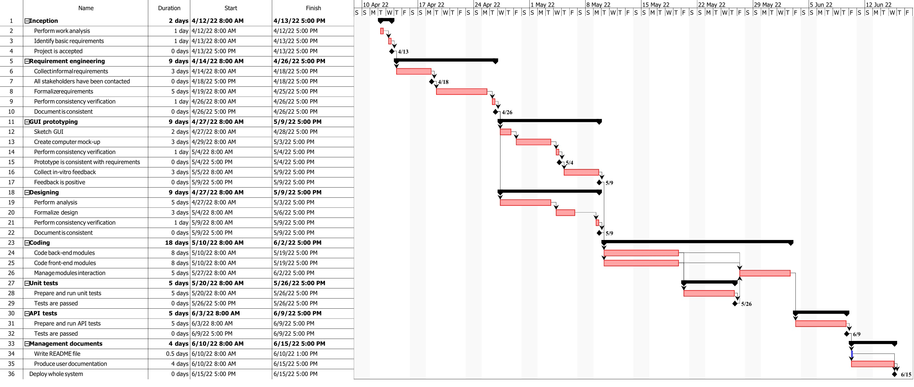

# Project Estimation
Authors: Ilaria Pilo, Marco Sacchet, Luca Scibetta, Enes Yarali

Date: 12 April 2022

Version: 1.3

# Estimation approach
All estimations are based on our judgment and slightly supported by previous projects.

## Estimate by size
### 
|             | Estimate                        |             
| ----------- | ------------------------------- |  
| NC =  Estimated number of classes to be developed   |       50 classes                     |             
|  A = Estimated average size per class, in LOC       |         200 LOC/class                  | 
| S = Estimated size of project, in LOC (= NC * A) | 10,000 LOC|
| E = Estimated effort, in person hours (here use productivity 10 LOC per person hour)  |             1,000 ph                         |   
| C = Estimated cost, in euro (here use 1 person hour cost = 30 euro) | € 30,000| 
| Estimated calendar time, in calendar weeks (Assume team of 4 people, 8 hours per day, 5 days per week ) |     6.25 calendar weeks               |               

## Estimate by product decomposition
### 
|         Component name    | Estimated effort (person hours)   |             
| ----------- | ------------------------------- | 
|Requirement document    | 130 |
| GUI prototype | 70 |
|Design document | 100 |
|Code |350 |
| Unit tests |200 |
| API tests |150 |
| Management documents  |70 |

## Estimate by activity decomposition

*LEGEND*  
**bold** : main activity  
\- : sub-activity  
◆ : milestone
### 
|         Activity name    | Estimated effort (person hours)   |             
| ----------- | ------------------------------- | 
| **Inception** ||
| - Perform word analysis | 32 |
| - Identify basic requirements | 32 |
| **Requirement Engineering** ||
| - Collect informal requirements | 96 |
| ◆ All stakeholders have been contacted | - |
| - Formalize requirements | 160 |
|  -Perform consistency verification | 32 |
| ◆ Document is consistent | - |
| **GUI Prototyping** ||
| - Sketch GUI | 64 |
| - Create computer mock-up | 96 |
| - Perform consistency verification | 32 |
| ◆ Prototype is consistent with requirements | - |
| - Collect in-vitro feedback | 96 |
| ◆ Feedback is positive | - |
| **Designing** ||
| - Perform analysis | 160 |
| - Formalize design | 96 |
| - Perform consistency verification | 32 |
| ◆ Document is consistent | - |
| **Coding** ||
| - Code back-end modules | 256 |
| - Code front-end modules | 256 |
| - Manage modules interaction | 160 |
| **Unit Tests** ||
| - Prepare and run Unit tests | 160 |
| ◆ Tests are passed | - |
| **API Tests** ||
| - Prepare and run API tests | 160 |
| ◆ Tests are passed | - |
| **Management Documents** ||
| - Write README file | 16 |
| - Produce user documentation | 128 |
| **Deployment** ||
| ◆ Deploy whole system | - |

###

## Summary

|             | Estimated effort                        |   Estimated duration |          
| ----------- | ------------------------------- | ---------------|
| Estimate by size |1,000 ph| 6.25 calendar weeks |
| Estimate by product decomposition | 1,070 ph | 6.8 calendar weeks |
| Estimate by activity decomposition |1,952 ph| 12.2 calendar weeks |

As we can see from the table, estimation by size and by product decomposition lead us to very similiar results. On the other hand, estimation by activity decomposition gives us a totally different outcome (that is almost double the previous ones).  
This can be due to the impossibility to internally parallelize some of the activities among different workers, which is more easily noticed while drawing the Gantt diagram.  
Overall, the result obtained by activity decomposition can be (possibly) considered as more reliable than those obtained with estimation by size and by product decomposition.

