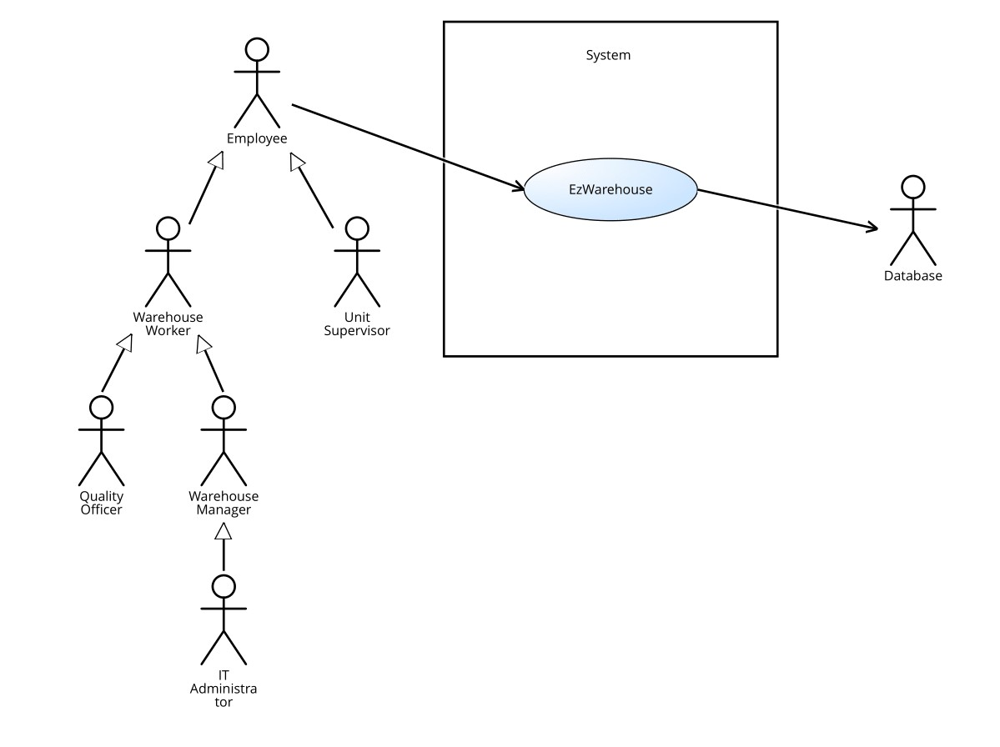
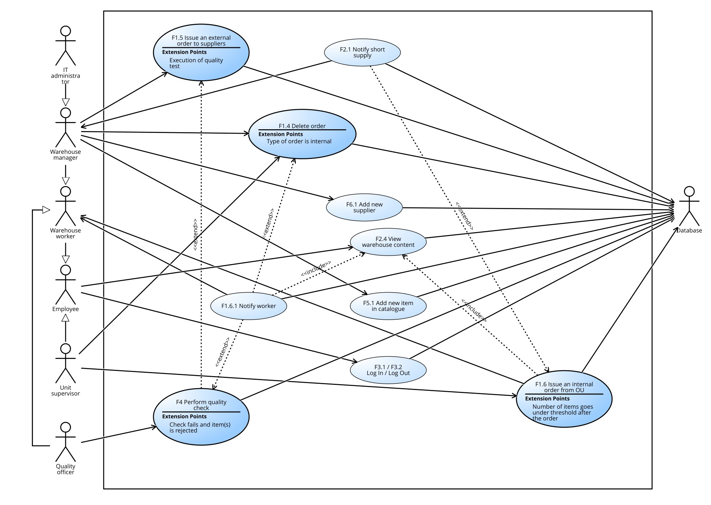
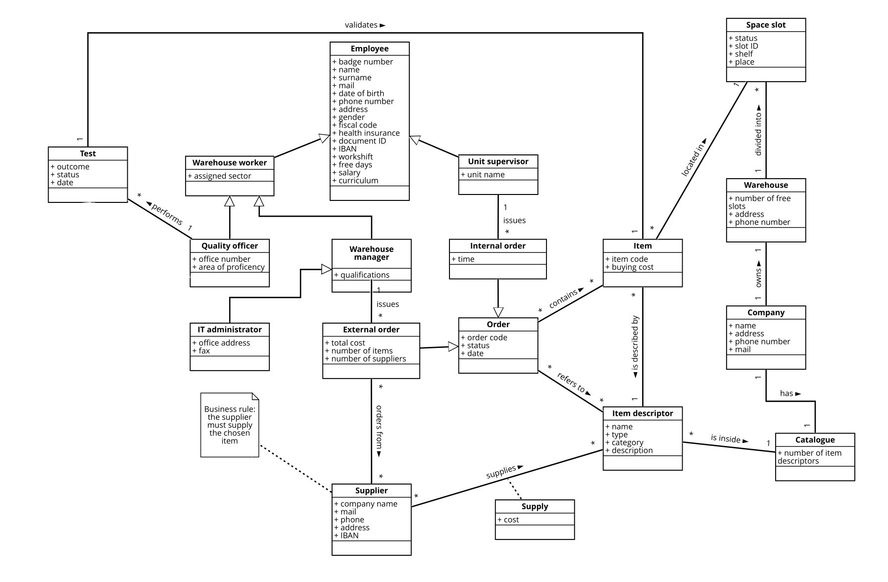
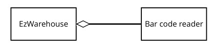

# Requirements Document 

Date: 12 April 2022

Version: 1.7

 
| Version number | Change |
| ----------------- |:-----------|
| 1.0 | Initial version |
| 1.1 | Added functional requirements to manage catalogue and suppliers list |
| 1.2 | Added a common generalization for all employees actors |
| 1.3 | Modified stories to make them compliant with the application functionalities |
| 1.4 | Removed a "design" class from Glossary |
| 1.5 | Explicited a generalization in Context diagram |
| 1.6 | Fixed Use case diagram |
| 1.7 | Removed a redundant scenario |

# Contents

- [Informal description](#informal-description)
- [Stakeholders](#stakeholders)
- [Context Diagram and interfaces](#context-diagram-and-interfaces)
	+ [Context Diagram](#context-diagram)
	+ [Interfaces](#interfaces) 
	
- [Stories and personas](#stories-and-personas)
- [Functional and non functional requirements](#functional-and-non-functional-requirements)
	+ [Functional Requirements](#functional-requirements)
	+ [Non functional requirements](#non-functional-requirements)
- [Use case diagram and use cases](#use-case-diagram-and-use-cases)
	+ [Use case diagram](#use-case-diagram)
	+ [Use cases](#use-cases)
- [Glossary](#glossary)
- [System design](#system-design)
- [Deployment diagram](#deployment-diagram)

# Informal description
Medium companies and retailers need a simple application to manage the relationship with suppliers and the inventory of physical items stocked in a physical warehouse. 
The warehouse is supervised by a manager, who supervises the availability of items. When a certain item is in short supply, the manager issues an order to a supplier. In general the same item can be purchased by many suppliers. The warehouse keeps a list of possible suppliers per item. 

After some time the items ordered to a supplier are received. The items must be quality checked and stored in specific positions in the warehouse. The quality check is performed by specific roles (quality office), who apply specific tests for item (different items are tested differently). Possibly the tests are not made at all, or made randomly on some of the items received. If an item does not pass a quality test it may be rejected and sent back to the supplier. 

Storage of items in the warehouse must take into account the availability of physical space in the warehouse. Further the position of items must be traced to guide later recollection of them.

The warehouse is part of a company. Other organizational units (OU) of the company may ask for items in the warehouse. This is implemented via internal orders, received by the warehouse. Upon reception of an internal order the warehouse must collect the requested item(s), prepare them and deliver them to a pick up area. When the item is collected by the other OU the internal order is completed. 

EZWH (EaSy WareHouse) is a software application to support the management of a warehouse.

# Stakeholders

| Stakeholder category | Subcategory |Name  | Description | 
| -----|-----|------- |-----------|
| COMPANY ||| Commercial business employing the EZWH application|
||CEO||Chief Executive Officer, buys the software to manage the company warehouse|
||IT Department||Department in charge of establishing, monitoring and maintaining IT systems and services|
|||IT administrator|Manages the application and its functionalities|
|||Security manager|Assesses and possibly enhances policies to protect confidential information|
|||DB administrator|Manages the interaction with the company database|
||Warehouse (WH)||Building storing manufactured goods prior to their distribution| 
|||Warehouse worker|Works *inside* the warehouse, physically interacts with items|
|||Warehouse manager| Supervises the availability of items in the warehouse|
|||Quality officer| Is responsible for testing items quality|
||Organizational Unit (OU)||Part of the company focused on a particular task|
|||Unit supervisor|Manages the OU requests for items in the warehouse|
||Financial Department||Unit responsible for handling company funds|
||Database || Pre-existing database, keeping track of the warehouse content|
|SOFTWARE HOUSE|||Company in charge of designing and developing the EZWH application|
||CEO||Chief Executive Officer, is responsible for taking managerial decision|
|||Project manager|Plans and executes the EZWH project|
|||Developer|Writes, debugs and executes the software source code|
|||Analyst|Defines requirements for the application|
|||Tester|Checks whether the application is compliant with the requirements|
|COMPETITOR|||Software already on the market offering the same or similar services as EZWH|
|SUPPLIER|||Organization providing items to the company|
|COURIER|||Company transporting commercial packages and documents|

# Context Diagram and interfaces

## Context diagram

Notice that *Employee* does not correspond to any profile/role, it is simply a conceptual generalization of all company profiles (for this reason, it is not listed neither among stakeholders nor among actors).

## Interfaces

| Actor | Logical Interface | Physical Interface  |
|-------|-------------------|---------------------|
|Unit supervisor |Landscape desktop GUI |Screen, keyboard, mouse |
|Warehouse worker |Landscape desktop GUI |Tablet |
|Warehouse manager |Landscape desktop GUI |Screen, keyboard, mouse |
|Quality officer |Landscape desktop GUI |Screen, keyboard, mouse |
|IT administrator |Landscape desktop GUI, command line interface |Screen, keyboard, mouse |
|Database |APIs| Intranet connection |

# Stories and personas

### Andy Cheaper
#### Bio
Age 59, warehouse manager, single man.  
Andy works for a big company passing through difficult times. For each item in short supply, he has to consult catalogues of many suppliers searching for the lowest price. This operation takes him even many hours per day.
#### Goals
* Wants to easily find low cost solutions for orders
* Wants to manage orderings more efficiently 
#### Story
It’s Friday afternoon, Andy receives a short supply notification and wants to proceed with the order before going home and enjoying a beer with his friends. Through the application, he can fastly search among the suppliers for the requested items, sorting them by increasing price. In few clicks he sends the order to the chosen supplier(s) and he is free to start his weekend knowing there won't be any backlog on Monday.

### Paul Messy
#### Bio
Age 42, quality officer, divorcing from his wife.  
Paul works as a quality officer in a medium size company’s warehouse. His duty is to perform quality checks on the items the suppliers deliver. For each test he has to fill a long and boring paper form, which subsequently has to be archived manually. Since Paul is not an organised person, his desk is fully covered with old forms that cost Paul many hours per day to search through.
#### Goals
* Wants to digitally manage quality check information
* Wants to rapidly retrieve information about an old quality check
#### Story
It's late Wednesday morning. In a few hours Paul will have to go to the lawyer to sign divorce papers. Before going, he has to fill out a report about two tests he performed in the past. In the blink of an eye, Paul is able to retrieve information about the items he has checked. Doing so, he manages to eat some healthy salad for lunch near the lawyer’s office and to arrive on time at the appointment. Maybe this program won’t allow him to keep his house, but certainly he will have more time to find a new one.

### Richard Bronson
#### Bio 
Age 63, warehouse worker, has knee joint problems and cataracts.  
Richard is a worker in a medium size company’s warehouse. His duty is to find the location of items ordered from the warehouse and pack them accordingly. After 43 years of working various blue collar jobs under harsh conditions, Richard can’t walk long distances at once and can’t stand on his feet for long. Just 2 years left until his retirement, Richard wants to do as little walking as possible.
#### Goals
* Wants to find the location of items as easily as possible
* Wants to check if he got the right item
#### Story
It's Tuesday afternoon, only two hours left for Richards shift to finish. Richard is sitting on his bench in the warehouse while rubbing his knees. Sometimes the pain from the kneecap replacement surgery he had last year is unbearable. When a new order comes in, Richard has to get up, find the item and take it to the packing station. In the past, finding the item was a nightmare for Richard's cataract and knees. Now, he can easily find the item place thanks to the tracking functionality. Moreover, he can check if he took the right item by scanning its barcode. The big green tick on tablet is a feast for Richard's eyes. He will never have to read the small code numbers and compare them one by one ever again.

# Functional and non functional requirements

## Functional Requirements

| Lev.1 ID | Lev.2 ID | Lev.3 ID   | Description  | Profile |
| ------|---|---- |-------|------| 
|F1 |||**Handle orders**||
||F1.1 ||Pick item(s) and quantity | Warehouse manager / Unit supervisor |
||F1.2 ||Keep order status (issued-processed-completed-deleted-aborted)||
||F1.3 ||Keep orders history||
||F1.4 ||Delete issued order||
||F1.5 ||Issue an external order to supplier | Warehouse manager |
|||F1.5.1 |Keep and inspect supplier list for each item descriptor||
|||F1.5.2 |Choose and notify supplier(s) -> order status = issued ||
|||F1.5.3 |Notify Financial Deptartment||
||F1.6 ||Issue an internal order from OU | Unit supervisor|
|||F1.6.1 |Notify wh workers -> order status = issued OR deleted |Unit supervisor| 
|||F1.6.2 |Notify unit supervisor -> order status = processed |Warehouse worker| 
|F2 |||**Monitor and modify warehouse content**||
||F2.1 ||Notify short supply |Warehouse manager|
||F2.2 ||Add item||
||F2.3 ||Remove item||
||F2.4 ||See details about warehouse content |Warehouse worker|
||F2.5 ||Track item position in warehouse |Warehouse worker|
||F2.6 ||Track available space||
||F2.7 ||See details about warehouse catalogue |Unit supervisor|
|F3||| **Manage users**||
||F3.1||Log in||
||F3.2 ||Log out||
||F3.3 ||Add/Remove users |IT administrator|
|F4 |||**Insert quality check information**|Quality officer|
||F4.1 ||Specify if quality check was done or not||
||F4.2 ||Keep track of quality check result||
||F4.3 || Notify if item has to be rejected ||
|F5 |||**Modify catalogue**|Warehouse manager|
||F5.1 ||Add item descriptor||
||F5.2 ||Remove item descriptor||
||F5.3 ||Add supplier for item descriptor||
||F5.4 ||Remove supplier for item descriptor||
|F6 |||**Modify supplier list**|Warehouse manager|
||F6.1 ||Add supplier||
||F6.2 ||Remove supplier||

## Non Functional Requirements

| ID        | Type     | Description  | Refers to |
| ------------- |-------------| -----| -----|
|NF1 |Usability | Basic users [^1] shall be able to use all functions after 1 hour training ||
|NF2 |Usability | Advanced users [^2] shall be able to use all functions after 3 hours training ||
|NF3 |Performance |Database should be queried in less than 1 second |F2.4|
|NF4 |Performance |All operations (no database-related) should be completed in less than 0.5 seconds ||
|NF5 |Space |Desktop application should occupy less than 500 MB||
|NF6 |Portability |Desktop application should be compatible with all main OSs ||
|NF7 |Privacy |Company data should be protected from external attacks||

[^1]: Warehouse worker, Unit supervisor
[^2]: Quality officer, Warehouse manager, IT administrator 

# Use case diagram and use cases

## Use Case Diagram

## Use Cases
### Use case 1, UC1 - Login

| Actors Involved        | Employee, Database |
| ------------- |-------------| 
|  Precondition     | Employee is not authenticated |
|  Post condition     | Employee is / is not authenticated |
|  Nominal Scenario     | Successful Login |
|  Exception     | Wrong Password |
|  Exception     | Employee Does Not Exist |

#### Scenario 1.1 - Successful Login

Employee succeeds in logging in.

| Scenario 1.1 - Successful Login | |
| ------------- |-------------| 
|  Precondition     |  Employee is not authenticated |
|  Post condition     | Employee is authenticated |
| Step#        | Description  |
|  1     | Employee starts application |  
|  2     | Application asks for ID and password |
|  3     | Employee enters ID and password |

#### Scenario 1.2 - Wrong Password

Employee enters the wrong password.

|  Scenario 1.2 - Wrong Password | |
| ------------- |-------------| 
|  Precondition     |  Employee is not authenticated |
|  Post condition     |  Employee is not authenticated. Application throws an error |
| Step#        | Description  |
|  1     | Employee starts application |  
|  2     | Application asks for ID and password |
|  3     | Employee enters wrong password |

#### Scenario 1.3 - Employee Does Not Exist

Employee enters the wrong ID.

|  Scenario 1.2 - Wrong ID | |
| ------------- |-------------| 
|  Precondition     |  Employee is not authenticated |
|  Post condition     |  Employee is not authenticated. Application throws an error |
| Step#        | Description  |
|  1     | Employee starts application |  
|  2     | Application asks for ID and password |
|  3     | Employee enters wrong ID |

### Use case 2, UC2 - Issue an external order to Supplier

| Actors Involved        | Warehouse Manager, Database |
| ------------- |-------------| 
|  Precondition     | Warehouse Manager is authenticated and has been notified an item is in short supply |
|  Post condition     | Order is / is not issued |
|  Nominal Scenario     | Successful order from 1 supplier |
|  Variant     | Successful order from more suppliers |
|  Exception     | Warehouse is out of physical space |

#### Scenario 2.1 - Successful order from 1 supplier

An order to one supplier is successfully issued.

| Scenario 2.1 - Successful order from 1 supplier | |
| ------------- |-------------| 
|  Precondition     | Warehouse Manager is authenticated and has been notified an item is in short supply |
|  Post condition     | Order is correctly issued (order status: issued)|
| Step#        | Description  |
|  1     | Warehouse Manager checks the list of suppliers for the item |  
|  2     | Warehouse Manager chooses one supplier to order the item from |
|  3     | Warehouse Manager selects the item quantity |
|  4     | Warehouse has enough space to store new items |
|  5     | Financial Department and supplier are (externally) notified |

#### Scenario 2.2 - Successful order from more suppliers

An order to more than one supplier is successfully issued.

| Scenario 2.2 - Successful order from more suppliers | |
| ------------- |-------------| 
|  Precondition     | Warehouse Manager is authenticated and has been notified an item is in short supply |
|  Post condition     | Order is correctly issued (order status: issued)|
| Step#        | Description  |
|  1     | Warehouse Manager checks the list of suppliers for the item |  
|  2     | Warehouse Manager chooses one supplier to order the item from |
|  3     | Warehouse Manager selects the item quantity |
||Repeat 2 and 3 for each supplier the Warehouse Manager wants to order from|
|  4     | Warehouse has enough space to store new items |
|  5     | Financial Department and suppliers are (externally) notified |

#### Scenario 2.3 - Warehouse is out of physical space

Warehouse is full and it is not possible to add new items.

| Scenario 2.3 - Warehouse is out of physical space | |
| ------------- |-------------| 
|  Precondition     | Warehouse Manager is authenticated and has been notified an item is in short supply |
|  Post condition     | Order is not issued|
| Step#        | Description  |
|  1     | Warehouse Manager checks the list of suppliers for the item |  
|  2     | Warehouse Manager chooses one supplier to order the item from |
|  3     | Warehouse Manager selects the item quantity |
|  4     | Warehouse has not enough space to store new items |

### Use case 3, UC3 - Issue an internal order from Organizational Unit

| Actors Involved        | Unit Supervisor, Warehouse Worker, Database, Warehouse Manager |
| ------------- |-------------| 
|  Precondition     | Unit Supervisor is authenticated |
|  Post condition     | Order is completed / aborted |
|  Nominal Scenario     | Successful internal order |
|  Variant     | Number of items goes under threshold after the order |
|  Exception     | Not enough items |

#### Scenario 3.1 - Successful internal order

An order to warehouse from an Organizational Unit is completed.

| Scenario 3.1 - Successful internal order | |
| ------------- |-------------| 
|  Precondition     | Unit supervisor is authenticated |
|  Post condition     | Order is completed (order status: completed)|
| Step#        | Description  |
|  1     | Unit supervisor checks the catalogue |  
|  2     | Unit supervisor selects the item to be ordered |
|  3     | Unit supervisor selects the item quantity |
||Repeat 2 and 3 for each item the Unit Supervisor wants to order|
|  4     | Warehouse contains all ordered items |
|  5     | Warehouse worker is notified (order status: issued) |
|  6     | Warehouse worker retrieves the position of ordered items |
|  7     | Warehouse worker collects ordered items |
|  8     | Warehouse worker prepares ordered items |
|  9     | Warehouse worker delivers ordered items to the pick up area |
|  10    | Unit supervisor is notified (order status: processed) |
|  11    | Items are collected from pick up area |
|  12    | Item quantities are updated |
|  13    | Item quantities are not below the short supply threshold |

#### Scenario 3.2 - Number of items goes under threshold after the order

An order to warehouse from an Organizational Unit is completed. After it, the number of items goes below the short supply threshold.

| Scenario 3.2 - Number of items goes under threshold after the order | |
| ------------- |-------------| 
|  Precondition     | Unit supervisor is authenticated |
|  Post condition     | Order is completed (order status: completed)|
| Post condition | Warehouse Manager is notified of item(s) in short supply |
| Step#        | Description  |
|  1     | Unit supervisor checks the catalogue |  
|  2     | Unit supervisor selects the item to be ordered |
|  3     | Unit supervisor selects the item quantity |
||Repeat 2 and 3 for each item the Unit Supervisor wants to order|
|  4     | Warehouse contains all ordered items |
|  5     | Warehouse worker is notified (order status: issued) |
|  6     | Warehouse worker retrieves the position of ordered items |
|  7     | Warehouse worker collects ordered items |
|  8     | Warehouse worker prepares ordered items |
|  9     | Warehouse worker delivers ordered items to the pick up area |
|  10    | Unit supervisor is notified (order status: processed) |
|  11    | Items are collected from pick up area |
|  12    | Item quantities are updated |
|  13    | At least one item quantity is below the short supply threshold |
| 14 | Warehouse Manager is notified |
|| Repeat 14 for each item whose quantity is below the threshold |

#### Scenario 3.3 - Not enough items

There is not enough of the requested items inside the warehouse.

| Scenario 3.3 - Not enough items | |
| ------------- |-------------| 
|  Precondition     | Unit Supervisor is authenticated |
|  Post condition     | Order is aborted (order status: aborted) |
| Step#        | Description  |
|  1     | Unit Supervisor checks the catalogue |  
|  2     | Unit Supervisor selects the item to be ordered |
|  3     | Unit Supervisor selects the item quantity |
|| Repeat 2 and 3 for each item the unit supervisor wants to order |
|  4     | Warehouse does not contains all ordered items |
| 5 | Unit Supervisor is notified |

### Use case 4, UC4 - Delete an order

| Actors Involved        | Warehouse Manager, Unit Supervisor, Warehouse Worker, Database, IT Administrator |
| ------------- |-------------| 
|  Precondition     | Unit Supervisor / Warehouse Manager is authenticated |
|  Post condition     | Order is / is not deleted |
|  Nominal Scenario (1)     | Successful deletion (external) |
|  Nominal Scenario (2)     | Successful deletion (internal) |
|  Exception     | Order already processed |
|  Exception | System error |

#### Scenario 4.1 - Successful deletion of external order

An order is successfully deleted by the Warehouse Manager.

| Scenario 4.1 - Successful deletion of external order | |
| ------------- |-------------| 
|  Precondition     | Warehouse Manager is authenticated |
|  Post condition     | Order is deleted (order status: deleted)|
| Step#        | Description  |
|  1     | Warehouse Manager checks the orders history |  
|  2     | Warehouse Manager deletes the order |
|  3     | Supplier is notified about the deleted order |

#### Scenario 4.2 - Successful deletion of internal order

An order is successfully deleted by the Unit Supervisor.	

| Scenario 4.2 - Successful deletion of internal order | |
| ------------- |-------------| 
|  Precondition     | Unit Supervisor is authenticated |
|  Post condition     | Order is deleted (order status: deleted)|
| Step#        | Description  |
|  1     | Unit Supervisor checks the orders history |  
|  2     | Unit Supervisor deletes the order |
|  3     | Warehouse Worker is notified about the deleted order |

#### Scenario 4.3 - Order already processed

An order is already processed and it cannot be deleted.	

| Scenario 4.3 - Order already processed | |
| ------------- |-------------| 
|  Precondition     | Warehouse Manager is authenticated |
|  Post condition     | Order is not deleted|
| Step#        | Description  |
|  1     | Warehouse Manager checks the orders history |  
|  2     | Warehouse Manager deletes the order |
|  3     | Supplier is notified about the deleted order |
| 4 | Supplier sends feedback: Order already processed and shipped |

#### Scenario 4.4 - System Error

System raises an error.

| Scenario 4.4 - System Error | |
| ------------- |-------------| 
|  Precondition     | Warehouse Manager is authenticated |
|  Post condition     | Order is not deleted|
| Step#        | Description  |
|  1     | Warehouse Manager checks the orders history |  
|  2     | Warehouse Manager deletes the order |
|  3     | System raises an error |
| 4 | IT Administrator is notified about the technical error |

### Use case 5, UC5 - Perform Quality Check

| Actors Involved        | Quality Officer, Database |
| ------------- |-------------| 
|  Precondition | Quality officer is authenticated |
|  Post condition     | Quality Check is performed|
|  Nominal Scenario     | Quality Check passed |
|  Variant     | Quality Check failed, item kept |
|  Exception | Quality Check failed, item rejected |

#### Scenario 5.1 - Quality Check passed

The Quality Check is passed.

| Scenario 5.1 - Quality Check passed | |
| ------------- |-------------| 
| Precondition | Quality Officer is authenticated |
|  Post condition     | The check is performed and passed |
| Step#        | Description  |
|  1     | Quality Officer takes the item |  
|  2     | The item passes the test |
|  3     | Quality Officer adds the information for the item in the application |

#### Scenario 5.2 - Quality Check not passed, item kept

The Quality Check is not passed but the item is kept.

| Scenario 5.2 - Quality Check not passed, item kept| |
| ------------- |-------------| 
| Precondition | Quality Officer is authenticated |
|  Post condition     | The check is performed and not passed |
| Step#        | Description  |
|  1     | Quality Officer takes the item |  
|  2     | The item fails the test |
|  3     | Quality Officer adds the information for the item in the application |

#### Scenario 5.3 - Quality Check not passed, item rejected

The Quality Check is not passed and the item is rejected.

| Scenario 5.3 - Quality Check not passed, item rejected | |
| ------------- |-------------| 
| Precondition | Quality Officer is authenticated |
|  Post condition     | The check is performed and not passed |
| Step#        | Description  |
|  1     | Quality Officer takes the item |  
|  2     | The item fails the test |
|  3     | Quality Officer adds the information for the item in the application |
| 4 | Quality Officer notify the Warehouse Manager that the item has to be rejected (through the application)|

### Use case 6, UC6 - Add a Supplier in the System

| Actors Involved        | Manager, Database |
| ------------- |-------------| 
|  Precondition | Warehouse Manager is authenticated |
|  Precondition | Supplier has to be added |
|  Post condition     | Supplier is / is not added |
|  Nominal Scenario     | Supplier added |
|  Exception | Supplier already present|

#### Scenario 6.1 - Supplier Added

Successful adding of a Supplier in the system.

| Scenario 6.1 - Supplier Added | |
| ------------- |-------------| 
|  Precondition     | Warehouse Manager is authenticated|
|  Post condition     | Supplier is added successfully |
| Step#        | Description  |
|  1     | Warehouse Manager inserts information about the Supplier |  
|  2     | Warehouse Manager adds the information in the System |

#### Scenario 6.2 - Supplier already present

The supplier is already present in the system.

| Scenario 6.2 - Supplier already present | |
| ------------- |-------------| 
|  Precondition     | Warehouse Manager is authenticated|
|  Post condition     |  Supplier is not added |
| Step#        | Description  |
|  1     | Warehouse Manager inserts information about the Supplier |  
|  2     | Warehouse Manager adds the information in the System |
|  3    | System reject the modification |

### Use case 7, UC7 - Add an item descriptor in the Catalogue

| Actors Involved        | Warehouse Manager, Database |
| ------------- |-------------| 
|  Precondition | Warehouse Manager is authenticated |
|  Post condition     | Item descriptor is / is not added|
|  Nominal Scenario     | Item descriptor added |
|  Exception | Item descriptor already present |

#### Scenario 7.1 - Item descriptor added

Successful adding Item descriptor in the Catalogue.

| Scenario 7.1 - Item descriptor added | |
| ------------- |-------------| 
|  Precondition     | Warehouse Manager is authenticated|
|  Post condition     | Item descriptor is added successfully |
| Step#        | Description  |
|  1     | Warehouse Manager inserts information about the Item descriptor|  
|  2     | Warehouse Manager adds the information in the Catalogue |

#### Scenario 7.2 - Item descriptor already present

Item descriptor is already present in the Catalogue.

| Scenario 7.2 - Item descriptor already present| |
| ------------- |-------------| 
|  Precondition     | Warehouse Manager is authenticated|
|  Post condition     | Item descriptor is not added  |
| Step#        | Description  |
|  1     | Warehouse Manager insert information about the Item descriptor|  
|  2     | Warehouse Manager adds the information in the Catalogue |
| 3 | System detect Item descriptor is already present |

### Use case 8, UC8 - Visualize Wareouse content

| Actors Involved        | Employee, Database |
| ------------- |-------------| 
|  Precondition | Employee is authenticated |
|  Post condition     | Employee does / does not access to information |
|  Nominal Scenario     | Information displayed |
|  Exception |  Employee has no permission to see requested information |

#### Scenario 8.1 - Information displayed

Requested information is successfully displayed.

| Scenario 8.1 - Information displayed | |
| ------------- |-------------| 
|  Precondition     | Employee is authenticated|
|  Post condition     | Employee accesses information |
| Step#        | Description  |
|  1     | Employee selects the information he wants to visualise |  
|  2     | System visualises information |

#### Scenario 8.2 - No authorization for requested information

Employee has not the correct authorization to access requested information.

| Scenario 8.2 - No authorization for requested information | |
| ------------- |-------------| 
|  Precondition     | Employee is authenticated|
|  Post condition     | Employee does not access information |
| Step#        | Description  |
|  1     | Employee selects the information he wants to visualise |  
|  2     | System denies visualisation of requested information |

# Glossary

This glossary is focused on how entities interact with each other, rather than on their definition (to avoid redundancies).

# System Design

# Deployment Diagram 

