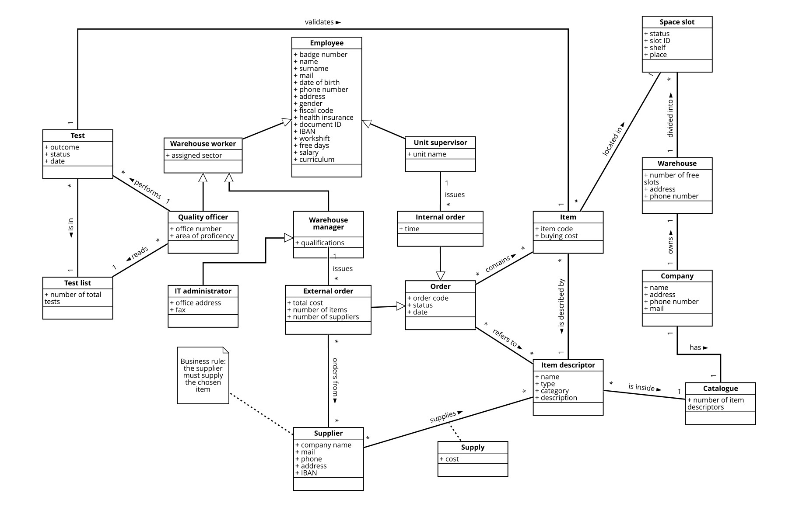

# Requirements Document 

Date: 08 April 2022

Version: 1.2

 
| Version number | Change |
| ----------------- |:-----------|
| 1.0 | Initial version |
| 1.1 | Added functional requirements to manage catalogue and suppliers list |
| 1.2 | Added a common generalization for all employees actors |

# Contents

- [Informal description](#informal-description)
- [Stakeholders](#stakeholders)
- [Context Diagram and interfaces](#context-diagram-and-interfaces)
	+ [Context Diagram](#context-diagram)
	+ [Interfaces](#interfaces) 
	
- [Stories and personas](#stories-and-personas)
- [Functional and non functional requirements](#functional-and-non-functional-requirements)
	+ [Functional Requirements](#functional-requirements)
	+ [Non functional requirements](#non-functional-requirements)
- [Use case diagram and use cases](#use-case-diagram-and-use-cases)
	+ [Use case diagram](#use-case-diagram)
	+ [Use cases](#use-cases)
    	+ [Relevant scenarios](#relevant-scenarios)
- [Glossary](#glossary)
- [System design](#system-design)
- [Deployment diagram](#deployment-diagram)

# Informal description
Medium companies and retailers need a simple application to manage the relationship with suppliers and the inventory of physical items stocked in a physical warehouse. 
The warehouse is supervised by a manager, who supervises the availability of items. When a certain item is in short supply, the manager issues an order to a supplier. In general the same item can be purchased by many suppliers. The warehouse keeps a list of possible suppliers per item. 

After some time the items ordered to a supplier are received. The items must be quality checked and stored in specific positions in the warehouse. The quality check is performed by specific roles (quality office), who apply specific tests for item (different items are tested differently). Possibly the tests are not made at all, or made randomly on some of the items received. If an item does not pass a quality test it may be rejected and sent back to the supplier. 

Storage of items in the warehouse must take into account the availability of physical space in the warehouse. Further the position of items must be traced to guide later recollection of them.

The warehouse is part of a company. Other organizational units (OU) of the company may ask for items in the warehouse. This is implemented via internal orders, received by the warehouse. Upon reception of an internal order the warehouse must collect the requested item(s), prepare them and deliver them to a pick up area. When the item is collected by the other OU the internal order is completed. 

EZWH (EaSy WareHouse) is a software application to support the management of a warehouse.

# Stakeholders

| Stakeholder category | Subcategory |Name  | Description | 
| -----|-----|------- |-----------|
| COMPANY ||| Commercial business employing the EZWH application|
||CEO||Chief Executive Officer, buys the software to manage the company warehouse|
||IT Department||Department in charge of establishing, monitoring and maintaining IT systems and services|
|||IT administrator|Manages the application and its functionalities|
|||Security manager|Assesses and possibly enhances policies to protect confidential information|
|||DB administrator|Manages the interaction with the company database|
||Warehouse (WH)||Building storing manufactured goods prior to their distribution| 
|||Warehouse worker|Works *inside* the warehouse, physically interacts with items|
|||Warehouse manager| Supervises the availability of items in the warehouse|
|||Quality officer| Is responsible for testing items quality|
||Organizational Unit (OU)||Part of the company focused on a particular task|
|||Unit supervisor|Manages the OU requests for items in the warehouse|
||Financial Department||Unit responsible for handling company funds|
||Database || Pre-existing database, keeping track of the warehouse content|
|SOFTWARE HOUSE|||Company in charge of designing and developing the EZWH application|
||CEO||Chief Executive Officer, is responsible for taking managerial decision|
|||Project manager|Plans and executes the EZWH project|
|||Developer|Writes, debugs and executes the software source code|
|||Analyst|Defines requirements for the application|
|||Tester|Checks whether the application is compliant with the requirements|
|COMPETITOR|||Software already on the market offering the same or similar services as EZWH|
|SUPPLIER|||Organization providing items to the company|
|COURIER|||Company transporting commercial packages and documents|

# Context Diagram and interfaces

## Context diagram

Notice that all actors are independently connected to the EzWarehouse system, to emphatize their different interactions with it.

## Interfaces

| Actor | Logical Interface | Physical Interface  |
|-------|-------------------|---------------------|
|Warehouse manager |Landscape desktop GUI |Screen, keyboard, mouse |
|Unit supervisor |Landscape desktop GUI |Screen, keyboard, mouse |
|IT administrator |Landscape desktop GUI, command line interface |Screen, keyboard, mouse |
|Quality officer |Landscape desktop GUI |Screen, keyboard, mouse |
|Warehouse worker |Landscape desktop GUI |Tablet |
|Database |APIs| Internet Connection |

# Stories and personas
\<A Persona is a realistic impersonation of an actor. Define here a few personas and describe in plain text how a persona interacts with the system>

\<Persona is-an-instance-of actor>

\<stories will be formalized later as scenarios in use cases>

# Functional and non functional requirements

## Functional Requirements

| Lev.1 ID | Lev.2 ID | Lev.3 ID   | Description  | Profile |
| ------|---|---- |-------|------| 
|F1 |||Handle orders||
||F1.1 ||Pick item(s) and quantity | Warehouse manager / Unit supervisor |
||F1.2 ||Keep order status (issued-processed-completed-deleted-aborted)||
||F1.3 ||Keep orders history||
||F1.4 ||Delete order||
||F1.5 ||Issue an external order to supplier | Warehouse manager |
|||F1.5.1 |Keep and inspect supplier list for each item descriptor||
|||F1.5.2 |Choose and notify supplier(s) -> order status = issued ||
|||F1.5.3 |Notify Financial Deptartment||
||F1.6 ||Issue an internal order from OU | Unit supervisor|
|||F1.6.1 |Notify wh workers -> order status = issued OR deleted |Unit supervisor| 
|||F1.6.2 |Notify unit supervisor -> order status = processed |Warehouse worker| 
|F2 |||Monitor and modify warehouse content||
||F2.1 ||Notify short supply |Warehouse manager|
||F2.2 ||Add item||
||F2.3 ||Remove item||
||F2.4 ||See details about warehouse content |Warehouse worker|
||F2.5 ||Track item position in warehouse |Warehouse worker|
||F2.6 ||Track available space||
||F2.7 ||See details about warehouse catalogue |unit supervisor|
|F3||| Manage users||
||F3.1||Log in||
||F3.2 ||Log out||
||F3.3 ||Add/Remove users |IT administrator|
|F4 |||Insert quality check information|Quality officer|
||F4.1 ||Specify if quality check was done or not||
||F4.2 ||Keep track of quality check result||
||F4.3 || Notify if item has to be rejected ||
|F5 |||Modify catalogue|Warehouse manager|
||F5.1 ||Add item descriptor||
||F5.2 ||Remove item descriptor||
||F5.3 ||Add supplier for item descriptor||
||F5.4 ||Remove supplier for item descriptor||
|F6 |||Modify supplier list|Warehouse manager|
||F6.1 ||Add supplier||
||F6.2 ||Remove supplier||

## Non Functional Requirements

| ID        | Type     | Description  | Refers to |
| ------------- |-------------| -----| -----|
|NF1 |Usability | Basic users shall be able to use all functions after 1 hour training ||
|NF2 |Usability | Advanced users shall be able to use all functions after 3 hours training ||
|NF3 |Performance |Database should be queried in less than 1 second |F2.4|
|NF4 |Performance |All operations (no database-related) should be completed in less than 0.5 seconds ||
|NF5 |Space |Desktop application should occupy less than 500 MB||
|NF6 |Portability |Desktop application should be compatible with all main OSs ||
|NF7 |Privacy |Company data should be protected from external attacks||

# Use case diagram and use cases

### Use case 1, UC1 - Login

| Actors Involved        | User, Database |
| ------------- |-------------| 
|  Precondition     | User is not authenticated |
|  Post condition     | User is authenticated |
|  Nominal Scenario     | Successful Login |
|  Exception     | Wrong Password |
|  Exception     | User Does Not Exist |

#### Scenario 1.1 - Successful Login

User succeed in logging in

| Scenario 1.1 - Successful Login | |
| ------------- |-------------| 
|  Precondition     |  User is not authenticated |
|  Post condition     | User is authenticated |
| Step#        | Description  |
|  1     | User starts application |  
|  2     | Application asks for ID and password |
|  3     | User enters ID and password |

#### Scenario 1.2 - Wrong Password

User enter the wrong password

|  Scenario 1.2 - Wrong Password | |
| ------------- |-------------| 
|  Precondition     |  User is not authenticated |
|  Post condition     |  Application throws an error |
| Step#        | Description  |
|  1     | User starts application |  
|  2     | Application asks for ID and password |
|  3     | User enters wrong password |

#### Scenario 1.3 - User Does Not Exist

User enter the wrong ID

|  Scenario 1.2 - Wrong ID | |
| ------------- |-------------| 
|  Precondition     |  User is not authenticated |
|  Post condition     |  Application throws an error |
| Step#        | Description  |
|  1     | User starts application |  
|  2     | Application asks for ID and password |
|  3     | User enters wrong ID |

### Use case 2, UC2 - Issue an external order to Supplier

| Actors Involved        | Manager, Database |
| ------------- |-------------| 
|  Precondition     | Warehouse manager is authenticated |
| Precondition | It has been notified an item is in short supply |
|  Post condition     | Order is / is not issued |
|  Nominal Scenario     | Successful order from 1 supplier |
|  Variant     | Successful order from more suppliers |
|  Exception     | Warehouse is out of physical space |

#### Scenario 2.1 - Successful order from 1 supplier

An order to one supplier is issued successfully

| Scenario 2.1 - Successful order from 1 supplier | |
| ------------- |-------------| 
|  Precondition     | Warehouse manager is authenticated |
| Precondition | It has been notified an item is in short supply |
|  Post condition     | Order is correctly issued (order status: issued)|
| Step#        | Description  |
|  1     | Warehouse manager checks the list of suppliers for the item |  
|  2     | Warehouse manager choose one supplier to order the item from |
|  3     | Warehouse manager selects the item quantity |
|  4     | Warehouse has enough space to store new items |
|  5     | Financial Department and supplier are (externally) notified |

#### Scenario 2.2 - Successful order from more suppliers

An order to more than one supplier is issued successfully

| Scenario 2.2 - Successful order from more suppliers | |
| ------------- |-------------| 
|  Precondition     | Warehouse manager is authenticated |
| Precondition | It has been notified an item is in short supply |
|  Post condition     | Order is correctly issued (order status: issued)|
| Step#        | Description  |
|  1     | Warehouse manager checks the list of suppliers for the item |  
|  2     | Warehouse manager choose one supplier to order the item from |
||Repeat 2 and 3 for each supplier the warehouse manager wants to order from|
|  3     | Warehouse manager selects the item quantity |
|  4     | Warehouse has enough space to store new items |
|  5     | Financial Department and supplier are (externally) notified |

#### Scenario 2.3 - Warehouse is out of physical space

Warehouse is full and is not possible to add new items

| Scenario 2.3 - Warehouse is out of physical space | |
| ------------- |-------------| 
|  Precondition     | Warehouse manager is authenticated |
| Precondition | It has been notified an item is in short supply |
|  Post condition     | Order is NOT issued|
| Step#        | Description  |
|  1     | Warehouse manager checks the list of suppliers for the item |  
|  2     | Warehouse manager chooses one supplier to order the item from |
|  3     | Warehouse manager selects the item quantity |
|  4     | Warehouse has not enough space to store new items |

### Use case 3, UC3 - Issue an internal order from Organisational Unit

| Actors Involved        | Unit Supervisor, Warehouse Worker, Database, Manager |
| ------------- |-------------| 
|  Precondition     | Unit Supervisor is authenticated |
|  Post condition     | Order is completed / aborted |
|  Nominal Scenario     | Successful internal order |
|  Variant     | Number of items goes under threshold after the order |
|  Exception     | Not enough items |

#### Scenario 3.1 - Successful internal order

An order to warehouse from an Organisational Unit is issued successfully

| Scenario 3.1 - Successful internal order | |
| ------------- |-------------| 
|  Precondition     | Unit supervisor is authenticated |
| Precondition | It has been notified an item is in short supply |
|  Post condition     | Order is correctly issued (order status: completed)|
| Step#        | Description  |
|  1     | Unit supervisor checks the catalogue |  
|  2     | Unit supervisor selects the item to be ordered |
|  3     | Unit supervisor selects the item quantity |
||Repeat 2 and 3 for each item the Unit Supervisor wants to order|
|  4     | Warehouse contains all ordered items |
|  5     | Warehouse worker is notified (order status: issued) |
|  6     | Warehouse worker retrieves the position of ordered items |
|  7     | Warehouse worker collects ordered items |
|  8     | Warehouse worker prepares ordered items |
|  9     | Warehouse worker delivers ordered items to the pick up area |
|  10    | Unit supervisor is notified (order status: processed) |
|  11    | Items are collected from pick up area |
|  12    | Item quantities are updated |
|  13    | Item quantities are not below the short supply threshold |

#### Scenario 3.2 - Number of items goes under threshold after the order

An order to warehouse from an Organisational Unit is issued successfully, after it the number of items goes below a threshold

| Scenario 3.2 - Number of items goes under threshold after the order | |
| ------------- |-------------| 
|  Precondition     | Unit supervisor is authenticated |
|  Post condition     | Order is completed (order status: completed)|
| Post condition | Warehouse manager is notified of item(s) in short supply |
| Step#        | Description  |
|  1     | Unit supervisor checks the catalogue |  
|  2     | Unit supervisor selects the item to be ordered |
|  3     | Unit supervisor selects the item quantity |
||Repeat 2 and 3 for each item the Unit Supervisor wants to order|
|  4     | Warehouse contains all ordered items |
|  5     | Warehouse worker is notified (order status: issued) |
|  6     | Warehouse worker retrieves the position of ordered items |
|  7     | Warehouse worker collects ordered items |
|  8     | Warehouse worker prepares ordered items |
|  9     | Warehouse worker delivers ordered items to the pick up area |
|  10    | Unit supervisor is notified (order status: processed) |
|  11    | Items are collected from pick up area |
|  12    | Item quantities are updated |
|  13    | At least one item quantity is below the short supply threshold |
| 14 | Warehouse Manager is notified |
|| Repeat 14 for each item whose quantity is below the threshold |

#### Scenario 3.3 - Not enough items

There is not enough of the requested items inside the warehouse 

| Scenario 3.3 - Not enough items | |
| ------------- |-------------| 
|  Precondition     | Unit Supervisor is authenticated |
| Precondition | It has been notified an item is in short supply |
|  Post condition     | Order is aborted (order status: aborted) |
| Step#        | Description  |
|  1     | Unit Supervisor checks the catalogue |  
|  2     | Unit Supervisor selects the item to be ordered |
|  3     | Unit Supervisor selects the item quantity |
|| Repeat 2 and 3 for each item the unit supervisor wants to order |
|  4     | Warehouse does not contains all ordered items |
| 5 | Unit Supervisor is notified |

### Use case 4, UC4 - Delete an order

| Actors Involved        | Manager, Unit Supervisor, Warehouse Worker, Database, IT Administrator |
| ------------- |-------------| 
|  Precondition     | Unit Supervisor / Warehouse Manager is authenticated |
|  Post condition     | Order is / is not deleted |
|  Nominal Scenario     | Successful deletion (external) |
|  Nominal Scenario     | Successful deletion (internal) |
|  Exception     | Order already processed |
|  Exception | System error |

#### Scenario 4.1 - Successful deletion of external order

An order is successfully deleted by the Warehouse Manager	

| Scenario 4.1 - Successful deletion of external order | |
| ------------- |-------------| 
|  Precondition     | Warehouse manager is authenticated |
|  Post condition     | Order is deleted from the Database (order status: Deleted)|
| Step#        | Description  |
|  1     | Warehouse manager checks the order list |  
|  2     | Warehouse manager deletes the order |
|  3     | Supplier is notified about the deleted order |

#### Scenario 4.2 - Successful deletion of internal order

An order is successfully deleted by the Unit Supervisor	

| Scenario 4.2 - Successful deletion of internal order | |
| ------------- |-------------| 
|  Precondition     | Unit Supervisor is authenticated |
|  Post condition     | Order is deleted from the Database (order status: Deleted)|
| Step#        | Description  |
|  1     | Unit Supervisorr checks the order list |  
|  2     | Unit Supervisor deletes the order |
|  3     | Warehouse Worker is notified about the deleted order |

#### Scenario 4.3 - Order already processed

An order is already processed and it can not be deleted	

| Scenario 4.3 - Order already processed | |
| ------------- |-------------| 
|  Precondition     | Warehouse manager is authenticated |
|  Post condition     | Order is not deleted from the Database |
| Step#        | Description  |
|  1     | Warehouse manager checks the order list |  
|  2     | Warehouse manager deletes the order |
|  3     | Supplier is notified about the deleted order |
| 4 | Supplier sends feedback: Order already processed and shipped |

#### Scenario 4.4 - System Error

System raises an error

| Scenario 4.4 - System Error | |
| ------------- |-------------| 
|  Precondition     | Warehouse manager is authenticated |
|  Post condition     | Order is not deleted from the Database |
| Step#        | Description  |
|  1     | Warehouse manager checks the order list |  
|  2     | Warehouse manager deletes the order |
|  3     | System raises an error |
| 4 | IT administrator is notified about the technical error |

### Use case 5, UC5 - Perform Quality Check

| Actors Involved        | Quality Officer, Database |
| ------------- |-------------| 
|  Precondition | An item ordered from a supplier has to be checked |
|  Precondition | Quality officer is authenticated |
|  Post condition     | The quality check is performed and passed |
|  Nominal Scenario     | Quality Check passed |
|  Variant     | Quality Check failed, item kept |
|  Exception | Quality Check failed, item rejected |

#### Scenario 5.1 - Quality Check passed

The quality check is passed

| Scenario 5.1 - Quality Check passed | |
| ------------- |-------------| 
|  Precondition     | An item ordered from a supplier has to be checked |
| Precondition | Quality officer is authenticated |
|  Post condition     | The check is performed and passed |
| Step#        | Description  |
|  1     | Quality officer take the item |  
|  2     | Quality officer perform successfully the test |
|  3     | Quality officer add the information for the item in the application |

#### Scenario 5.2 - Quality Check not passed, item kept

The quality check is not passed but the item is kept

| Scenario 5.2 - Quality Check not passed, item kept| |
| ------------- |-------------| 
|  Precondition     | An item ordered from a supplier has to be checked |
| Precondition | Quality officer is authenticated |
|  Post condition     | The check is performed and not passed |
| Step#        | Description  |
|  1     | Quality officer take the item |  
|  2     | The item fail the test |
|  3     | Quality officer add the information for the item in the application |

#### Scenario 5.3 - Quality Check not passed, item rejected

The quality check is not passed and the item is rejected

| Scenario 5.3 - Quality Check not passed, item rejected | |
| ------------- |-------------| 
|  Precondition     | An item ordered from a supplier has to be checked |
| Precondition | Quality officer is authenticated |
|  Post condition     | The check is performed and not passed |
| Step#        | Description  |
|  1     | Quality officer take the item |  
|  2     | The item fail the test |
|  3     | Quality officer add the information for the item in the application |
| 4 | Quality officer notify the manager that the item has to be rejected |

### Use case 6, UC6 - Add a Supplier in the System

| Actors Involved        | Manager, Database |
| ------------- |-------------| 
|  Precondition | Manager is authenticated |
|  Precondition | Supplier has to be added |
|  Post condition     | Supplier is added successfully |
|  Nominal Scenario     | Supplier added |
|  Exception | Supplier already added |

#### Scenario 6.1 - Supplier Added

Successful adding of a Supplier in the System

| Scenario 6.1 - Supplier Added | |
| ------------- |-------------| 
|  Precondition     | Warehouse Manager is authenticated|
| Precondition |  Supplier has to be added  |
|  Post condition     | Supplier is added successfully |
| Step#        | Description  |
|  1     | Warehouse Manager insert information about the Supplier |  
|  2     | Warehouse manager adds the information in the System |

# Glossary

This glossary is focused on how entities interact with each other, rather than on their definition (to avoid redundancies).

# System Design
\<describe here system design>

\<must be consistent with Context diagram>

# Deployment Diagram 

\<describe here deployment diagram >

