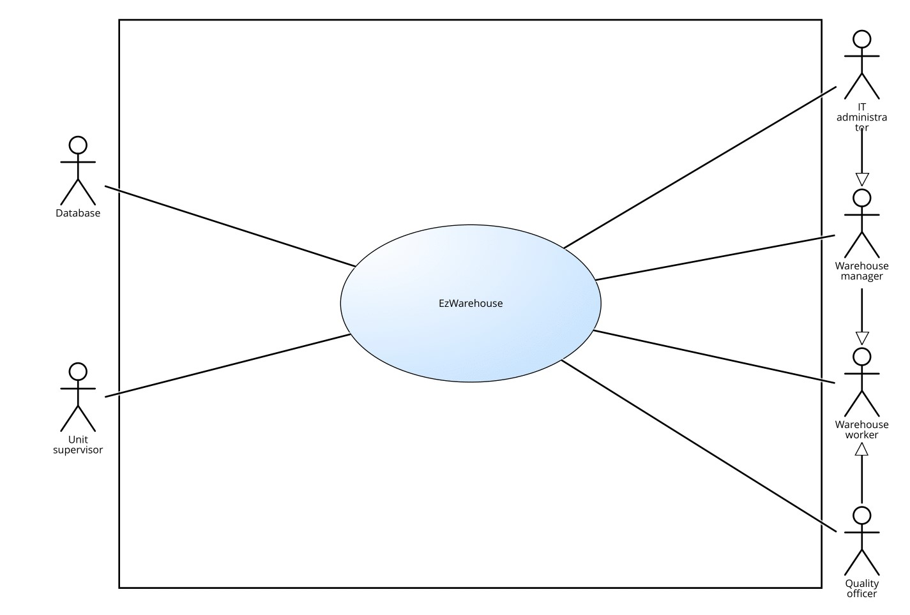

 #Requirements Document 

Date: 05 April 2022

Version: 1.2

 
| Version number | Change |
| ----------------- |:-----------|
| 1.1 | -- |
| 1.2 | Added functional requirements to manage catalogue and suppliers list |

# Contents

- [Informal description](#informal-description)
- [Stakeholders](#stakeholders)
- [Context Diagram and interfaces](#context-diagram-and-interfaces)
	+ [Context Diagram](#context-diagram)
	+ [Interfaces](#interfaces) 
	
- [Stories and personas](#stories-and-personas)
- [Functional and non functional requirements](#functional-and-non-functional-requirements)
	+ [Functional Requirements](#functional-requirements)
	+ [Non functional requirements](#non-functional-requirements)
- [Use case diagram and use cases](#use-case-diagram-and-use-cases)
	+ [Use case diagram](#use-case-diagram)
	+ [Use cases](#use-cases)
    	+ [Relevant scenarios](#relevant-scenarios)
- [Glossary](#glossary)
- [System design](#system-design)
- [Deployment diagram](#deployment-diagram)

# Informal description
Medium companies and retailers need a simple application to manage the relationship with suppliers and the inventory of physical items stocked in a physical warehouse. 
The warehouse is supervised by a manager, who supervises the availability of items. When a certain item is in short supply, the manager issues an order to a supplier. In general the same item can be purchased by many suppliers. The warehouse keeps a list of possible suppliers per item. 

After some time the items ordered to a supplier are received. The items must be quality checked and stored in specific positions in the warehouse. The quality check is performed by specific roles (quality office), who apply specific tests for item (different items are tested differently). Possibly the tests are not made at all, or made randomly on some of the items received. If an item does not pass a quality test it may be rejected and sent back to the supplier. 

Storage of items in the warehouse must take into account the availability of physical space in the warehouse. Further the position of items must be traced to guide later recollection of them.

The warehouse is part of a company. Other organizational units (OU) of the company may ask for items in the warehouse. This is implemented via internal orders, received by the warehouse. Upon reception of an internal order the warehouse must collect the requested item(s), prepare them and deliver them to a pick up area. When the item is collected by the other OU the internal order is completed. 

EZWH (EaSy WareHouse) is a software application to support the management of a warehouse.

# Stakeholders

| Stakeholder category | Subcategory |Name  | Description | 
| -----|-----|------- |-----------|
| COMPANY ||| Commercial business employing the EZWH application|
||CEO||Chief Executive Officer, buys the software to manage the company warehouse|
||IT Department||Department in charge of establishing, monitoring and maintaining IT systems and services|
|||IT administrator|Manages the application and its functionalities|
|||Security manager|Assesses and possibly enhances policies to protect confidential information|
|||DB administrator|Manages the interaction with the company database|
||Warehouse (WH)||Building storing manufactured goods prior to their distribution| 
|||Warehouse worker|Works *inside* the warehouse, physically interacts with items|
|||Warehouse manager| Supervises the availability of items in the warehouse|
|||Quality officer| Is responsible for testing items quality|
||Organizational Unit (OU)||Part of the company focused on a particular task|
|||Unit supervisor|Manages the OU requests for items in the warehouse|
||Financial Department||Unit responsible for handling company funds|
||Database || Pre-existing database, keeping track of the warehouse content|
|SOFTWARE HOUSE|||Company in charge of designing and developing the EZWH application|
||CEO||Chief Executive Officer, is responsible for taking managerial decision|
|||Project manager|Plans and executes the EZWH project|
|||Developer|Writes, debugs and executes the software source code|
|||Analyst|Defines requirements for the application|
|||Tester|Checks whether the application is compliant with the requirements|
|COMPETITOR|||Software already on the market offering the same or similar services as EZWH|
|SUPPLIER|||Organization providing items to the company|
|COURIER|||Company transporting commercial packages and documents|

# Context Diagram and interfaces

## Context diagram

## Interfaces

| Actor | Logical Interface | Physical Interface  |
|-------|-------------------|---------------------|
|Warehouse manager |Landscape desktop GUI |Screen, keyboard, mouse |
|Unit supervisor |Landscape desktop GUI |Screen, keyboard, mouse |
|IT administrator |Landscape desktop GUI, command line interface |Screen, keyboard, mouse |
|Quality officer |Landscape desktop GUI |Screen, keyboard, mouse |
|Warehouse worker |Landscape desktop GUI |Tablet |
|Database |APIs| Internet Connection |

# Stories and personas
\<A Persona is a realistic impersonation of an actor. Define here a few personas and describe in plain text how a persona interacts with the system>

\<Persona is-an-instance-of actor>

\<stories will be formalized later as scenarios in use cases>

# Functional and non functional requirements

## Functional Requirements

| Lev.1 ID | Lev.2 ID | Lev.3 ID   | Description  | Profile |
| ------|---|---- |-------|------| 
|F1 |||Handle orders||
||F1.1 ||Pick item(s) and quantity | Warehouse manager / Unit supervisor |
||F1.2 ||Keep order status (issued-processed-completed-deleted-aborted)||
||F1.3 ||Keep orders history||
||F1.4 ||Delete order||
||F1.5 ||Issue an external order to supplier | Warehouse manager |
|||F1.5.1 |Keep and inspect supplier list for each item descriptor||
|||F1.5.2 |Choose and notify supplier(s) -> order status = issued ||
|||F1.5.3 |Notify Financial Deptartment||
||F1.6 ||Issue an internal order from OU | Unit supervisor|
|||F1.6.1 |Notify wh workers -> order status = issued OR deleted |Unit supervisor| 
|||F1.6.2 |Notify unit supervisor -> order status = processed |Warehouse worker| 
|F2 |||Monitor and modify warehouse content||
||F2.1 ||Notify short supply |Warehouse manager|
||F2.2 ||Add item||
||F2.3 ||Remove item||
||F2.4 ||See details about warehouse content |Warehouse worker|
||F2.5 ||Track item position in warehouse |Warehouse worker|
||F2.6 ||Track available space||
||F2.7 ||See details about warehouse catalogue |unit supervisor|
|F3||| Manage users||
||F3.1||Log in||
||F3.2 ||Log out||
||F3.3 ||Add/Remove users |IT administrator|
|F4 |||Insert quality check information|Quality officer|
||F4.1 ||Specify if quality check was done or not||
||F4.2 ||Keep track of quality check result||
||F4.3 || Notify if item has to be rejected ||
|F5 |||Modify catalogue|Warehouse manager|
||F5.1 ||Add item descriptor||
||F5.2 ||Remove item descriptor||
||F5.3 ||Add supplier for item descriptor||
||F5.4 ||Remove supplier for item descriptor||
|F6 |||Modify supplier list|Warehouse manager|
||F6.1 ||Add supplier||
||F6.2 ||Remove supplier||

## Non Functional Requirements

\<Describe constraints on functional requirements>

| ID        | Type     | Description  | Refers to |
| ------------- |-------------| -----| -----|
|NF1 |Usability | Basic users shall be able to use all functions after 1 hour training ||
|NF2 |Usability | Advanced users shall be able to use all functions after 3 hours training ||
|NF3 |Performance |Database should be queried in less than 1 second |F2.4|
|NF4 |Performance |All operations (no database-related) should be completed in less than 0.5 seconds ||
|NF5 |Space |Desktop application should occupy less than 500 MB||
|NF6 |Portability |Desktop application should be compatible with all main OSs ||
|NF7 |Privacy |Company data should be protected from external attacks||

# Use case diagram and use cases

## Use case diagram
\<define here UML Use case diagram UCD summarizing all use cases, and their relationships>

\<next describe here each use case in the UCD>
### Use case 1, UC1
| Actors Involved        |  |
| ------------- |:-------------:| 
|  Precondition     | \<Boolean expression, must evaluate to true before the UC can start> |
|  Post condition     | \<Boolean expression, must evaluate to true after UC is finished> |
|  Nominal Scenario     | \<Textual description of actions executed by the UC> |
|  Variants     | \<other normal executions> |
|  Exceptions     | \<exceptions, errors > |

##### Scenario 1.1 

\<describe here scenarios instances of UC1>

\<a scenario is a sequence of steps that corresponds to a particular execution of one use case>

\<a scenario is a more formal description of a story>

\<only relevant scenarios should be described>

| Scenario 1.1 | |
| ------------- |:-------------:| 
|  Precondition     | \<Boolean expression, must evaluate to true before the scenario can start> |
|  Post condition     | \<Boolean expression, must evaluate to true after scenario is finished> |
| Step#        | Description  |
|  1     |  |  
|  2     |  |
|  ...     |  |

##### Scenario 1.2

##### Scenario 1.x

### Use case 2, UC2
..

### Use case x, UCx
..

# Glossary

\<use UML class diagram to define important terms, or concepts in the domain of the system, and their relationships> 

\<concepts are used consistently all over the document, ex in use cases, requirements etc>

# System Design
\<describe here system design>

\<must be consistent with Context diagram>

# Deployment Diagram 

\<describe here deployment diagram >

