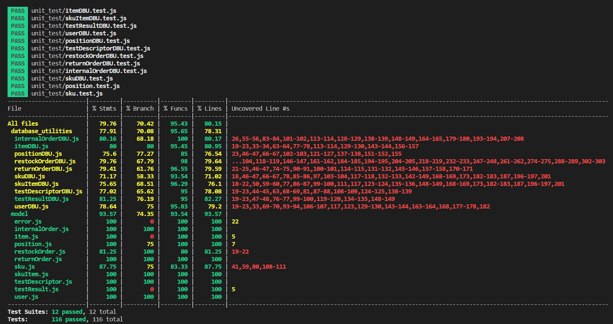

# Unit Testing Report

Date: 23/05/2022

Version: 1.0

# Contents

- [Note about unit testing](#note-about-unit-testing)
- [Black Box Unit Tests](#black-box-unit-tests)
- [White Box Unit Tests](#white-box-unit-tests)

# Note about unit testing
Since all `model` classes have few to none logic, we never test them explicitly - except `SKU` and `Position`. We simply check their behaviour is correct by source code inspection.  
For this reason, we consider as "independent units" - although they are not actually independent - `Position` and all `database_utilities` classes **but** `SkuDBU` and `PositionDBU`.

# Black Box Unit Tests

    <Define here criteria, predicates and the combination of predicates for each function of each class.
    Define test cases to cover all equivalence classes and boundary conditions.
    In the table, report the description of the black box test case and (traceability) the correspondence with the Jest test case writing the 
    class and method name that contains the test case>
    <Jest tests  must be in code/server/unit_test  >

 ### **Class *SKU* - method *constructor***

**Criteria for method *name*:**
	

 - 
 - 

**Predicates for method *name*:**

| Criteria | Predicate |
| -------- | --------- |
|          |           |
|          |           |
|          |           |
|          |           |

**Boundaries**:

| Criteria | Boundary values |
| -------- | --------------- |
|          |                 |
|          |                 |

**Combination of predicates**:

| Criteria 1 | Criteria 2 | ... | Valid / Invalid | Description of the test case | Jest test case |
|-------|-------|-------|-------|-------|-------|
|||||||
|||||||
|||||||
|||||||
|||||||

# White Box Unit Tests

### Test cases definition

| Unit name | Jest test case |
|--|--|
|Position|[position.test.js](./code/server/unit_test/position.test.js)|
|SKUitem + SKUitemDBU |[skuItemDBU.test.js](./code/server/unit_test/skuItemDBU.test.js)|
|TestDescriptor + TestDescriptorDBU|[testDescriptorDBU.test.js](./code/server/unit_test/testDescriptorDBU.test.js)|
|TestResult + TestResultDBU|[testResultDBU.test.js](./code/server/unit_test/testResultDBU.test.js)|
|User + UserDBU|[userDBU.test.js](./code/server/unit_test/userDBU.test.js)|
|RestockOrder + RestockOrderDBU|[restockOrderDBU.test.js](./code/server/unit_test/restockOrderDBU.test.js)|
|ReturnOrder + ReturnOrderDBU|[returnOrderDBU.test.js](./code/server/unit_test/returnOrderDBU.test.js)|
|InternalOrder + InteralOrderDBU|[internalOrderDBU.test.js](./code/server/unit_test/internalOrderDBU.test.js)|
|Item + ItemDBU|[itemDBU.test.js](./code/server/unit_test/itemDBU.test.js)|

### Code coverage report

Notice that almost all uncovered lines are safety checks on possible exceptions thrown by `sqlite3` APIs. For this reason, we were not able to directly test them. 

### Loop coverage analysis

Our units include very few loops, with almost no logic. Such loops are all written with a forEach-like structure, hence they are automatically handled by JavaScript, without the need for explicit checks by hand.